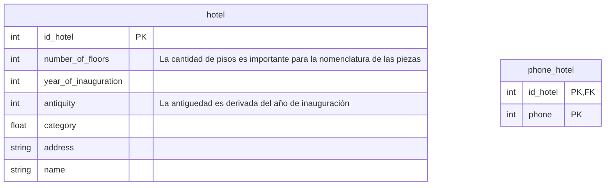
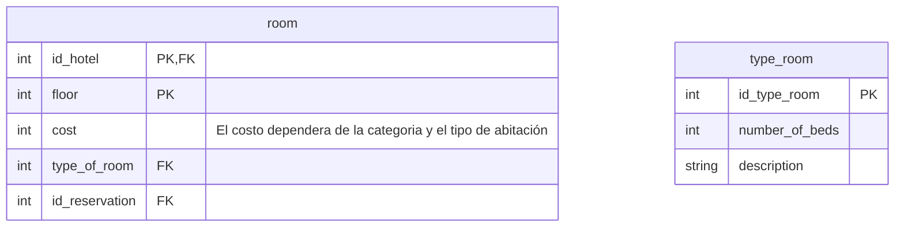
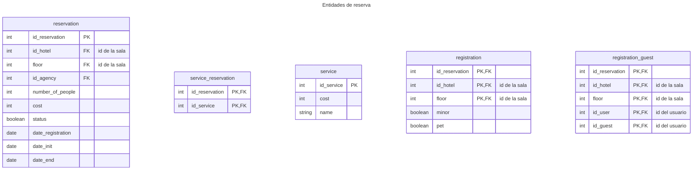
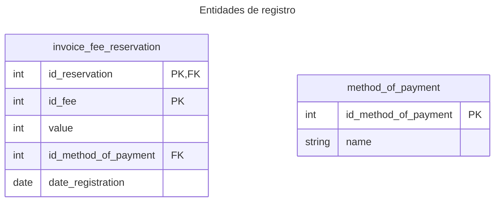
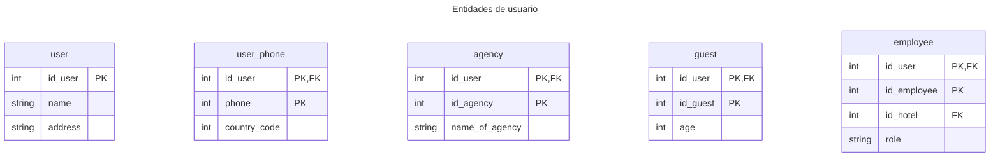
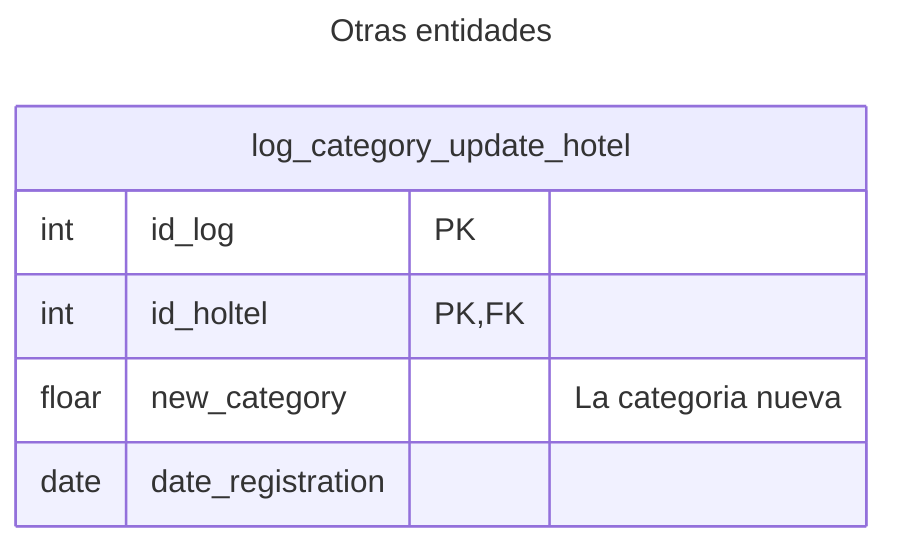

# Base de datos v2
Todas las entidades y atributos son esenciales para los requeriminetos del sistema **modularizados en microservicios**
> [!IMPORTANT]
> Esta es la primera version de la base de datos no esta acorde con el objetivo que es implementar micro servicios
> , por lo anterior se infiere es que de esta version se desacoplara distintos sistemas como
> usuarios, transacciones, negocio
## BD Gestion de habitacion
Son las entidades para manejar toda la información relacionada con las habitaciones, incluyendo su estado (disponible, ocupada, reservada), tipos de habitaciones, número de camas, y características adicionales (como vistas, comodidades).

**Hotel**

**Habitación**: El costo de una habitacion dependera del tipo de habitación y de la categoria del hotel

## Gestion de reservas
Son las entidades que de alguna u otra forma esta relacionada con la reserva por ejemplo el *registro* del usuario al llegar al hotel.

Manejar todo el ciclo de vida de las reservas de los clientes, desde la creación de una reserva hasta su confirmación y finalización.

**reservation**: La reservacion que hace o la agencia o el usuario responsable.

**service**: Servicios que puede tener la reservacion, por ejemplo:
 - Cuidado de mascotas
 - Parqueadero

**registration**: Registro de la reserva y la habitacion

**registration_guest**: Registro que asocia la habitacion al usuario

## Facturacion
Manejar todo lo relacionado con los pagos, facturas y métodos de pago.

**invoice_fee_reservation**: Las cuotas de pago de la reserva

**method_of_payment**: Metodos de pago que tiene la plataforma

## Gestion de usuarios
Son las entidades encargadas de definir roles y datos de todos los usuarios del sistema.

Gestionar tanto los perfiles de los huéspedes como del personal del hotel, con roles y permisos específicos.

**user**: Usuario del sistema

**agency**: Tipo de usuario (Rol)

**guest**: Tipo de usuario (Rol)

**employee**: Tipo de usuario (Rol)

## Otras entidades
Estas son entidades del sistema, datos que se usaran para algun analisis o otra funcionalidad.

**log_category_update_hotel**: Los hoteles inician por defecto una categoria de 0 y al momento de poner su verdadera categoria se genera un log ese debera ser el primer log y la categoria verdadera del hotel
