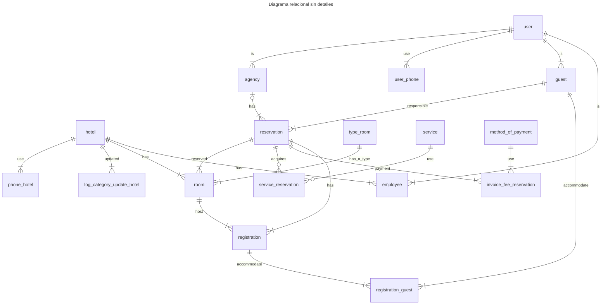
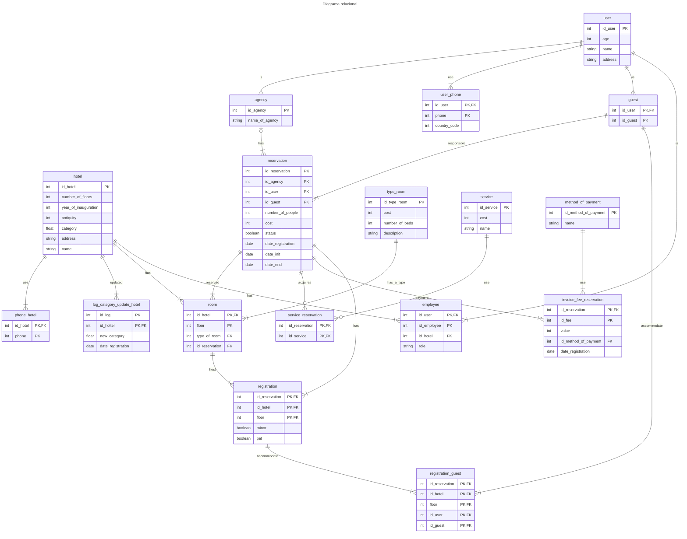

# Base de datos v1
Todas las entidades y atributos son esenciales para los requeriminetos del sistema
> [!IMPORTANT]
> Esta es la primera version de la base de datos no esta acorde con el objetivo que es implementar micro servicios
> , por lo anterior se infiere es que de esta version se desacoplara distintos sistemas como
> usuarios, transacciones, negocio
## Diagrama relacional v1
Este diagrama no sera el definitivo pero es el mas fiel a los requerimientos dados por la [premisa](../../planning/problem.md)

