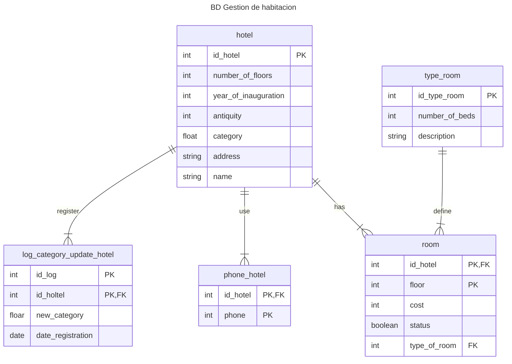
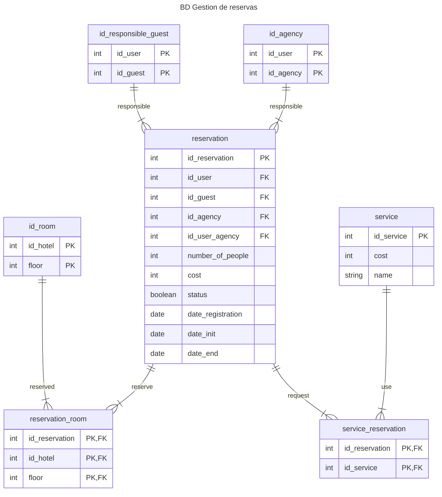
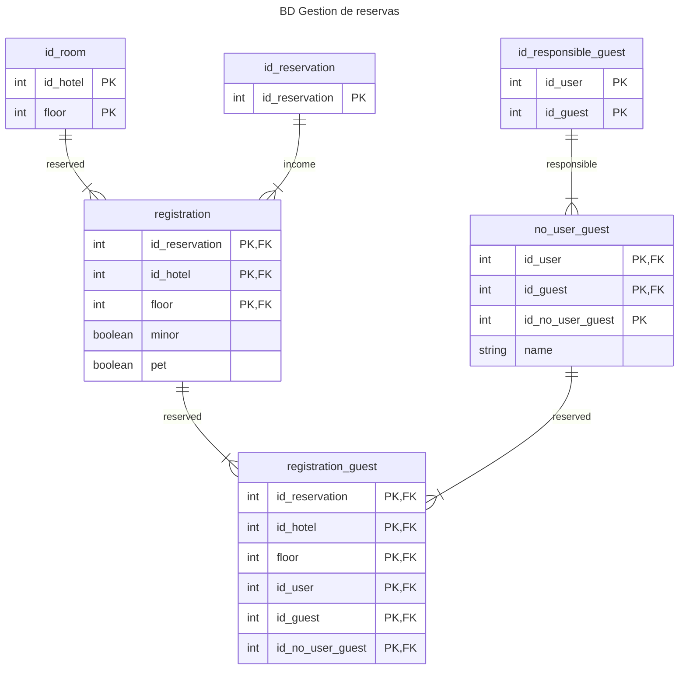
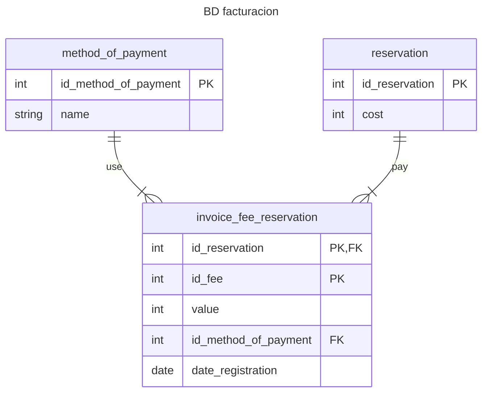
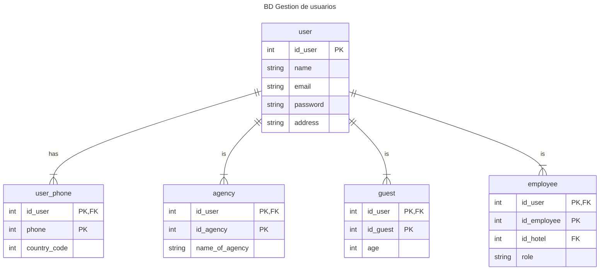

# Base de datos v3
Todas las entidades y atributos son esenciales para los requeriminetos del sistema **modularizados en microservicios**
> [!IMPORTANT]
> Esta es la tercera version del diccionario de datos de la base de datos
> contiene las entidades tablas de cada microservicio
## Gestion de habitaciones

## Gestion de reservas

## Gestion de registros

## Facturacion

## Gestion de usuarios
